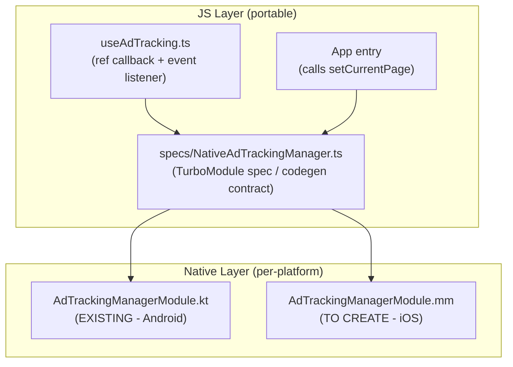

# iOS Ad Tracking Module -- Integration Plan

**Overview:** Port the Android ad tracking native module to iOS as an Objective-C++ TurboModule, adapt the JS hook to work without @react-navigation, and integrate all files into an existing New Architecture React Native app.

## Todos

- [ ] Copy specs/NativeAdTrackingManager.ts to target app's specs/ directory and configure codegenConfig in package.json
- [ ] Adapt useAdTracking.ts: replace useFocusEffect with useEffect, replace NavigationRouteContext with explicit screenKey param or constant
- [ ] Add NativeAdTrackingManager.setCurrentPage('main') call at app startup (useEffect in root component)
- [ ] Create ios/<AppName>/AdTrackingManagerModule.mm with TrackingState model, CADisplayLink loop, two-pass visibility algorithm, idle management, and event emission
- [ ] Add .mm file to Xcode target's Compile Sources, run pod install to trigger codegen
- [ ] Build with npx react-native run-ios, verify onImpression events fire correctly

---

## Architecture Overview

The POC has four portable layers. The native iOS module is the missing piece; the JS layer needs minor adaptation for a no-navigation app.



---

## Files to Copy / Create in the Target App

### 1. JS files (copy from POC, adapt)

| Source in POC | Destination in target app | Changes needed |
|---|---|---|
| `specs/NativeAdTrackingManager.ts` | `specs/NativeAdTrackingManager.ts` | None -- copy verbatim |
| `src/hooks/useAdTracking.ts` | Appropriate hooks directory | **Remove** `@react-navigation` dependency (see below) |
| `src/constants/index.ts` | Constants file | Copy `DEFAULT_THRESHOLD`, `DEFAULT_DURATION_MS`, `PAGE_ID`, `PAGE_TYPE` |

### 2. Native iOS file (create new)

| File | Location |
|---|---|
| `AdTrackingManagerModule.mm` | `ios/<AppName>/AdTrackingManagerModule.mm` |

### 3. `package.json` codegen config

Add or merge into the target app's `package.json`:

```json
"codegenConfig": {
  "name": "AppSpecs",
  "type": "modules",
  "jsSrcsDir": "specs"
}
```

---

## Step-by-Step Implementation

### Step 1 -- Copy the TurboModule spec

Copy `specs/NativeAdTrackingManager.ts` verbatim into the target app's `specs/` directory. This file defines the codegen contract and requires zero changes.

### Step 2 -- Adapt `useAdTracking.ts` for no-navigation

The current hook has two `@react-navigation` dependencies that must be replaced:

**A. `NavigationRouteContext` (line 4, 63-64):** Used to derive `screenKey` from the current route name. Since the target app has no navigation, either:

- Hard-code a constant `screenKey` (e.g. `"main"`), or
- Accept `screenKey` as an explicit parameter to the hook.

**B. `useFocusEffect` (line 4, 112-126):** Used to register/unregister views on screen focus/blur. Replace with a standard `useEffect` that registers on mount and unregisters on unmount:

```typescript
// BEFORE (with @react-navigation)
useFocusEffect(useCallback(() => { ... return cleanup; }, [...]));

// AFTER (no navigation)
useEffect(() => { ... return cleanup; }, [...]);
```

The rest of the hook (ref callback, event filtering, `getNativeTagFromInstance`) is fully platform-agnostic and needs no changes.

### Step 3 -- Call `setCurrentPage` at app startup

In the POC's `App.tsx`, `setCurrentPage` is called on every route change. Without navigation, call it once on mount with a fixed page key matching the `screenKey` used in Step 2:

```typescript
useEffect(() => {
  NativeAdTrackingManager.setCurrentPage('main');
}, []);
```

This is critical because the native module's cheap pass skips all views when `currentPageId` is `null`.

### Step 4 -- Create `ios/<AppName>/AdTrackingManagerModule.mm`

This is the main implementation file. It must mirror the Android module's logic 1:1. The file structure:

**A. TrackingState model** -- an `@interface` with the same fields as the Android `TrackingState` data class:

- `nodeId`, `threshold`, `durationSec`, `itemId`, `screenKey`, `pageId`, `pageType`
- Mutable: `timerStartedAt` (`CFTimeInterval`, 0 = not started), `impressionCount`, `firedThisSession`

**B. Module class** -- conforming to the codegen-generated `NativeAdTrackingManagerSpec` protocol:

```
@interface AdTrackingManagerModule : RCTEventEmitter <NativeAdTrackingManagerSpec>
```

Instance variables:

- `NSMutableDictionary<NSNumber *, TrackingState *> *_registry`
- `NSString *_currentPageId` (atomic)
- `CADisplayLink *_displayLink` (iOS equivalent of Android Choreographer)
- `CFTimeInterval _lastCheckTime` (for throttling at 150ms intervals)

**C. Spec methods to implement:**

| Method | iOS implementation notes |
|---|---|
| `registerView:config:` | Parse config dict, create `TrackingState`, add to `_registry`, resume `CADisplayLink` |
| `unregisterView:` | Remove from `_registry`; if empty, pause/invalidate `CADisplayLink` |
| `setCurrentPage:` | Set `_currentPageId`; resume `CADisplayLink` if matching views exist |
| `addListener:` | No-op |
| `removeListeners:` | No-op |
| `supportedEvents` | Return `@[@"onImpression"]` |

**D. Visibility loop (`CADisplayLink` callback)** -- direct port of `runVisibilityPass()`:

- **Throttle:** Check `CACurrentMediaTime() - _lastCheckTime >= 0.15`. Skip if too soon.
- **Cheap pass:** For each entry in `_registry`:
  - Resolve view via Fabric's `RCTComponentViewProtocol` or `[bridge.uiManager viewForReactTag:]`
  - Check `view.window != nil` (equivalent of `isAttachedToWindow`)
  - Check `view.bounds.size.width > 0 && height > 0`
  - Check `screenKey` matches `_currentPageId`
  - Build active set
- **Expensive pass:** For each active view:
  - Find `UIScrollView` ancestor by walking `view.superview`
  - Get viewport rect: scroll view bounds in window coords, or `UIScreen.mainScreen.bounds`
  - Get view rect in window coords: `[view convertRect:view.bounds toView:nil]`
  - Intersect: `CGRectIntersection(viewRect, viewportRect)`
  - Compute `ratio = intersectionArea / viewArea`
  - Timer logic: start timer at `CACurrentMediaTime()`, fire `onImpression` when elapsed >= `durationSec`
  - Set `firedThisSession = YES` to prevent re-fire

**E. Idle management:**

- After 2.5s with no active timers, pause the `CADisplayLink` (`_displayLink.paused = YES`). This is zero-cost.
- Resume on `registerView:` or `setCurrentPage:`.
- Precise follow-up: use `dispatch_after` on the main queue for the exact remaining duration.

**F. Profiling:** Use `os_signpost` from `<os/signpost.h>` for Instruments visibility.

**G. Event emission:**

```objc
[self sendEventWithName:@"onImpression" body:@{
    @"nodeId": @(tag),
    @"impressionCount": @(state.impressionCount),
    // itemId, pageId, pageType if non-nil
}];
```

**H. Module registration:**

```objc
RCT_EXPORT_MODULE(AdTrackingManager)
```

With TurboModules + codegen, this is auto-discovered. No `AppDelegate.mm` changes needed.

### Step 5 -- Add file to Xcode project

Open the `.xcworkspace` in Xcode, drag `AdTrackingManagerModule.mm` into the app group, and ensure it is added to the app target's "Compile Sources" build phase.

### Step 6 -- Run `pod install`

```bash
cd ios && pod install
```

This triggers codegen from `specs/NativeAdTrackingManager.ts`, generating the Objective-C protocol that the `.mm` file conforms to.

### Step 7 -- Build and verify

```bash
npx react-native run-ios
```

---

## Key iOS-Specific Differences from Android

| Concern | Android | iOS |
|---|---|---|
| Frame-sync loop | `Choreographer.postFrameCallback` | `CADisplayLink` added to `NSRunLoopCommonModes` |
| Throttle | `Handler.postDelayed` | `CACurrentMediaTime()` delta check inside display link callback |
| Idle sleep | Detach Choreographer + `OnPreDrawListener` wake-up | `_displayLink.paused = YES` / `= NO` |
| View resolution | `UIManagerHelper.resolveView(tag)` | Fabric: surface presenter mounting manager; Bridge: `[bridge.uiManager viewForReactTag:]` |
| Monotonic clock | `SystemClock.elapsedRealtime()` | `CACurrentMediaTime()` |
| Rect allocation | Pre-allocated `Rect` objects (heap) | Stack-allocated `CGRect` structs (inherently zero-alloc) |
| Profiling | `android.os.Trace` | `os_signpost` |
| Event emission | `ctx.emitDeviceEvent()` | `[self sendEventWithName:body:]` via `RCTEventEmitter` |

## Important: `CADisplayLink` run loop mode

The `CADisplayLink` **must** be added to `NSRunLoopCommonModes`, not `NSDefaultRunLoopMode`. In `NSDefaultRunLoopMode`, the display link pauses during `UIScrollView` tracking -- which is exactly when visibility checks matter most.

```objc
[_displayLink addToRunLoop:[NSRunLoop mainRunLoop] forMode:NSRunLoopCommonModes];
```
